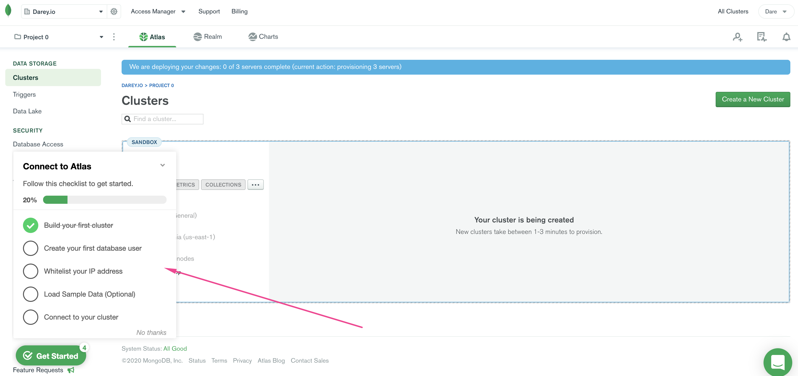

# SIMPLE TO-DO APPLICATION ON MERN WEB STACK
This project demonstrates the implementation of MongoDB ExpressJS Reactjs and NodeJS (MERN) in the cloud (AWS)
+ MongoDB: A document-based, No-SQL database used to store application data in a form of documents.

+ ExpressJS: A server side Web Application framework for Node.js.

+ ReactJS: A frontend framework developed by Facebook. It is based on JavaScript, used to build User Interface (UI) components.

+ Node.js: A JavaScript runtime environment. It is used to run JavaScript on a machine rather than in a browser.

##  TASK:-  To deploy a simple To-Do application that creates To-Do lists like this:

##  Steps in implementing LEMP stack
+  [x] 0.  Preparing virtual linux server in AWS 
    + Create and Login to your AWS account. 
    + Select your preferred region (the closest to you) and launch a new Elastic Cloud Compute (EC2) instance of t2.micro family with Ubuntu Server 20.04 LTS (HVM).
    
      + **IMPORTANT** – save your private key (.pem file) securely and do not share it with anyone! If you lose it, you will not be able to connect to your server ever again!
      + Also ensure your Security group allows incoming traffic from port 22, which is the default prtocol for **SSH** connection.
    + Connecting to EC2 terminal
      + Change directory into the loacation where your PEM file is. Most likely will be in the Downloads folder

            cd ~/Download
      + Change premissions for the private key file (.pem), otherwise you can get an error "Bad permissions"

            sudo chmod 0400 <private-key-name>.pem

      + Connect to the instance by running
            
            ssh -i <private-key-name>.pem ubuntu@<Public-IP-address>

      + Now you have just creaated your very first Linux server in the cloud.

      + As we know, we have TCP port 22 open by default on our EC2 machine to access it via SSH, so we need to add a rule to EC2 configuration to open inbound connection through port 80:
      

+ [x] 1. Backend Configuration 
    + Update ubuntu

          sudo apt update

    + Upgrade ubuntu

          sudo apt upgrade -y
      
    + Install Nodejs binary

          curl -fsSL https://deb.nodesource.com/setup_18.x | sudo -E bash -

    + Install Node.js and npm with the command below

          sudo apt-get install -y nodejs
    + verify node installation

          node -v 
    + verify npm installation

          npm -v
    
    + Now let's create a new directory for the TO-DO project

          mkdir Todo

    + verify if the Todo directory is created

          ls
    
    + Now let's get into the business, change the working directory to newly created directory

          cd Todo
    
    + Next, you will use the command npm init to initialise your project and install dependencies

          npm init
    + You can follow the guide below when prompted series of questions
      
    
    + Verify your installation to see the package.json installed:-   

          ls
+ [x] 2.  Installing **Expressjs** 
    + Install expressjs using npm while still in the directory **Todo**

          npm install express
    
    + create a file index.js with the command below

          touch index.js
    
    + Next install the dotenv module

          npm install dotenv
    
    + Open the index.js file with the command below

          vi index.js
    
    + Paste the below code in the file

          const express = require('express');
          require('dotenv').config();

          const app = express();

          const port = process.env.PORT || 5000;

          app.use((req, res, next) => {
          res.header("Access-Control-Allow-Origin", "\*");
          res.header("Access-Control-Allow-Headers", "Origin, X-Requested-With, Content-Type, Accept");
          next();
          });

          app.use((req, res, next) => {
          res.send('Welcome to Express');
          });

          app.listen(port, () => {
          console.log(`Server running on port ${port}`)
          });

    + Now we can start our server 

          node index.js
    + You should see Server running on port 5000 in your terminal because it was specified in the code you copied earlier to index.js.
    + Also it is important we open the port of **5000** on the security group like we did on port **80**.
    
    + Open up your browser and try to access your server’s Public IP or Public DNS name followed by port 5000:

          http://<PublicIP-or-PublicDNS>:5000
      + Note:- We can alsoget our public IP address through our console

             curl -s http://169.254.169.254/latest/meta-data/public-ipv4
    + There are three actions that our To-Do application needs to be able to do:
      + Create a new task
      + Display list of all tasks
      + Delete a completed task
    + Each task will be associated with some particular endpoint and will use different standard HTTP request methods: POST, GET, DELETE.
    + Let us create a folder routes which defines the various endpoint for our Todo app

          mkdir routes
    + change the directory to routes

          cd routes
    
    + create a file api.js

          vi api.js
    
    + Copy the below code to the file,then save and exit

          const express = require ('express');
          const router = express.Router();

          router.get('/todos', (req, res, next) => {

          });

          router.post('/todos', (req, res, next) => {

          });

          router.delete('/todos/:id', (req, res, next) => {

          })

          module.exports = router;
+ [x] 3.  Models 
    + create a Schema and a model, install mongoose which is a Node.js package that makes working with mongodb easier.
    
    + Change directory back Todo folder with cd .. and install Mongoose

          npm install mongoose
    + Create a new folder models :

          mkdir models
    + Change directory into the newly created ‘models’ folder with

          cd models
    + Inside the models folder, create a file and name it todo.js

          touch todo.js
      + Bonus: All the three aforementioned commands can be done with a simple command

            mkdir models && cd models && touch todo.js
    + Open the file created with `vi todo.js` then paste the code below in the file:

          const mongoose = require('mongoose');
          const Schema = mongoose.Schema;

          //create schema for todo
          const TodoSchema = new Schema({
          action: {
          type: String,
          required: [true, 'The todo text field is required']
          }
          })

          //create model for todo
          const Todo = mongoose.model('todo', TodoSchema);

          module.exports = Todo;
      + Now we need to update our routes from the file api.js in ‘routes’ directory to make use of the new model.

            vi api.js
      + Delete and paste the below command into the file:-  

            const express = require ('express');
            const router = express.Router();
            const Todo = require('../models/todo');

            router.get('/todos', (req, res, next) => {

            //this will return all the data, exposing only the id and action field to the client
            Todo.find({}, 'action')
            .then(data => res.json(data))
            .catch(next)
            });

            router.post('/todos', (req, res, next) => {
            if(req.body.action){
            Todo.create(req.body)
            .then(data => res.json(data))
            .catch(next)
            }else {
            res.json({
            error: "The input field is empty"
            })
            }
            });

            router.delete('/todos/:id', (req, res, next) => {
            Todo.findOneAndDelete({"_id": req.params.id})
            .then(data => res.json(data))
            .catch(next)
            })

            module.exports = router;

+ [x] 4.  MongoDB Database
    + We need a database where we will store our data. For this we will make use of mLab. mLab provides MongoDB database as a service solution (DBaaS), so to make life easy, you will need to [sign up](https://www.mongodb.com/atlas-signup-from-mlab) for a shared clusters free account, which is ideal for our use case. Sign up here. Follow the sign up process, select AWS as the cloud provider, and choose a region near you.
    + Complete a get started checklist as shown on the image below
    
    + Allow access to the MongoDB database from anywhere (Not secure, but it is ideal for testing)
    + Create a MongoDB database and collection inside mLab
    
    
    + In the index.js file, we specified process.env to access environment variables, but we have not yet created this file. So we need to do that now.
    + Create a file in your Todo directory and name it .env.

          vi .env
    + Add the connection string to access the database in it, just as below:

          DB = ‘mongodb+srv://<username>:<passowrd>@cluster0.cjuhijb.mongodb.net/?retryWrites=true&w=majority’
        + Ensure to update <username> and <password> according to your setup
        + Here is how to get your connection string
          
          
          
    + Now we need to update the index.js to reflect the use of .env so that Node.js can connect to the database.

          vi index.js
    + We can now paste the entire code below in the file.

          const express = require('express');
          const bodyParser = require('body-parser');
          const mongoose = require('mongoose');
          const routes = require('./routes/api');
          const path = require('path');
          require('dotenv').config();

          const app = express();

          const port = process.env.PORT || 5000;

          //connect to the database
          mongoose.connect(process.env.DB, { useNewUrlParser: true, useUnifiedTopology: true })
          .then(() => console.log(`Database connected successfully`))
          .catch(err => console.log(err));

          //since mongoose promise is depreciated, we overide it with node's promise
          mongoose.Promise = global.Promise;

          app.use((req, res, next) => {
          res.header("Access-Control-Allow-Origin", "\*");
          res.header("Access-Control-Allow-Headers", "Origin, X-Requested-With, Content-Type, Accept");
          next();
          });

          app.use(bodyParser.json());

          app.use('/api', routes);

          app.use((err, req, res, next) => {
          console.log(err);
          next();
          });

          app.listen(port, () => {
          console.log(`Server running on port ${port}`)
          });
    + Start your server using the command:

          node index.js
        + You shall see a message **Database connected successfully**

+ [x] 5.  Frontend Creation 
    + we will use the create-react-app command to scaffold our app in Todo directory

          npx create-react-app client -y
    + This will create a new folder in your Todo directory called client, where you will add all the react code.
    + Install concurrently. It is used to run more than one command simultaneously from the same terminal window.

          npm install concurrently --save-dev -y
    + Install nodemon. It is used to run and monitor the server. If there is any change in the server code, nodemon will restart it automatically and load the new changes.

          npm install nodemon --save-dev
    + In Todo folder open the package.json file. Change the highlighted part of the below screenshot and replace with the code below.

          "scripts": {
          "start": "node index.js",
          "start-watch": "nodemon index.js",
          "dev": "concurrently \"npm run start-watch\" \"cd client && npm start\""
          },
        
    + Change directory to **client**

          cd client
    + Open the package.json file

          vi package.json
      + Add the key value pair in the package.json file "proxy": "http://localhost:5000"
    + Now, ensure you are inside the Todo directory, and simply do:

          npm run dev
    + Your app should open and start running on localhost:3000
      + In order to be able to access the application from the Internet you have to open TCP port 3000 on EC2 by adding a new Security Group rule. You already know how to do it.
    + Now let us create react components

          cd client
    + move to the src directory

          cd src
    + Inside your src folder create another folder called components

          mkdir components
    + Move into the components directory with

          cd components
    + Inside ‘components’ directory create three files Input.js, ListTodo.js and Todo.js.

          touch Input.js ListTodo.js Todo.js
    + Open Input.js file

          vi Input.js
    + Copy and paste the following

          import React, { Component } from 'react';
          import axios from 'axios';

          class Input extends Component {

          state = {
          action: ""
          }

          addTodo = () => {
          const task = {action: this.state.action}

              if(task.action && task.action.length > 0){
                axios.post('/api/todos', task)
                  .then(res => {
                    if(res.data){
                      this.props.getTodos();
                      this.setState({action: ""})
                    }
                  })
                  .catch(err => console.log(err))
              }else {
                console.log('input field required')
              }

          }

          handleChange = (e) => {
          this.setState({
          action: e.target.value
          })
          }

          render() {
          let { action } = this.state;
          return (
          

          <input type="text" onChange={this.handleChange} value={action} />
          <button onClick={this.addTodo}>add todo</button>
          

          )
          }
          }

          export default Input

    + To make use of Axios, which is a Promise based HTTP client for the browser and node.js, you need to cd into your client from your terminal and run yarn add axios or npm install axios. Move to the src folder

          cd ..
    + Move to clients folder

          cd ..
    + Install Axios

          npm install axios
    + Go to **components** directory

          cd src/components
    + After that open your ListTodo.js

          vi ListTodo.js
    + in the ListTodo.js copy and paste the following code

          import React from 'react';

          const ListTodo = ({ todos, deleteTodo }) => {

          return (
          <ul>
          {
          todos &&
          todos.length > 0 ?
          (
          todos.map(todo => {
          return (
          <li key={todo._id} onClick={() => deleteTodo(todo._id)}>{todo.action}</li>
          )
          })
          )
          :
          (
          <li>No todo(s) left</li>
          )
          }
          </ul>
          )
          }

          export default ListTodo
    
    + Then in your Todo.js file you write the following code

          import React, {Component} from 'react';
          import axios from 'axios';

          import Input from './Input';
          import ListTodo from './ListTodo';

          class Todo extends Component {

          state = {
          todos: []
          }

          componentDidMount(){
          this.getTodos();
          }

          getTodos = () => {
          axios.get('/api/todos')
          .then(res => {
          if(res.data){
          this.setState({
          todos: res.data
          })
          }
          })
          .catch(err => console.log(err))
          }

          deleteTodo = (id) => {

              axios.delete(`/api/todos/${id}`)
                .then(res => {
                  if(res.data){
                    this.getTodos()
                  }
                })
                .catch(err => console.log(err))

          }

          render() {
          let { todos } = this.state;

              return(
                

                  <h1>My Todo(s)</h1>
                  <Input getTodos={this.getTodos}/>
                  <ListTodo todos={todos} deleteTodo={this.deleteTodo}/>
                

              )

          }
          }

          export default Todo;
    
    + Move to the src folder

          cd ..
    + Make sure that you are in the src folder and run

          vi App.js
    + Copy and paste the code below into it

          import React from 'react';

          import Todo from './components/Todo';
          import './App.css';

          const App = () => {
          return (
          

          <Todo />
          

          );
          }

          export default App;
    + In the src directory open the App.css

          vi App.css
    + Paste the following code in the file

          .App {
          text-align: center;
          font-size: calc(10px + 2vmin);
          width: 60%;
          margin-left: auto;
          margin-right: auto;
          }

          input {
          height: 40px;
          width: 50%;
          border: none;
          border-bottom: 2px #101113 solid;
          background: none;
          font-size: 1.5rem;
          color: #787a80;
          }

          input:focus {
          outline: none;
          }

          button {
          width: 25%;
          height: 45px;
          border: none;
          margin-left: 10px;
          font-size: 25px;
          background: #101113;
          border-radius: 5px;
          color: #787a80;
          cursor: pointer;
          }

          button:focus {
          outline: none;
          }

          ul {
          list-style: none;
          text-align: left;
          padding: 15px;
          background: #171a1f;
          border-radius: 5px;
          }

          li {
          padding: 15px;
          font-size: 1.5rem;
          margin-bottom: 15px;
          background: #282c34;
          border-radius: 5px;
          overflow-wrap: break-word;
          cursor: pointer;
          }

          @media only screen and (min-width: 300px) {
          .App {
          width: 80%;
          }

          input {
          width: 100%
          }

          button {
          width: 100%;
          margin-top: 15px;
          margin-left: 0;
          }
          }

          @media only screen and (min-width: 640px) {
          .App {
          width: 60%;
          }

          input {
          width: 50%;
          }

          button {
          width: 30%;
          margin-left: 10px;
          margin-top: 0;
          }
          }
    
    + In the src directory open the index.css

          vi index.css
    + Copy and paste the code below:

          body {
          margin: 0;
          padding: 0;
          font-family: -apple-system, BlinkMacSystemFont, "Segoe UI", "Roboto", "Oxygen",
          "Ubuntu", "Cantarell", "Fira Sans", "Droid Sans", "Helvetica Neue",
          sans-serif;
          -webkit-font-smoothing: antialiased;
          -moz-osx-font-smoothing: grayscale;
          box-sizing: border-box;
          background-color: #282c34;
          color: #787a80;
          }

          code {
          font-family: source-code-pro, Menlo, Monaco, Consolas, "Courier New",
          monospace;
          }
    
    + Go to the Todo directory

          cd ../..
    + When you are in the Todo directory run:

          npm run dev
    + Go to `http://<ip-address>:3000` on your browser.
    